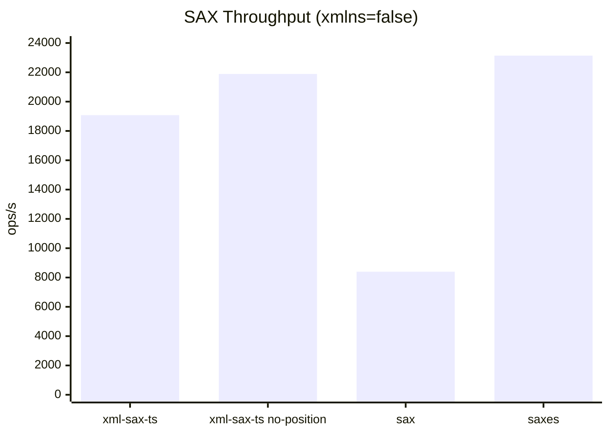
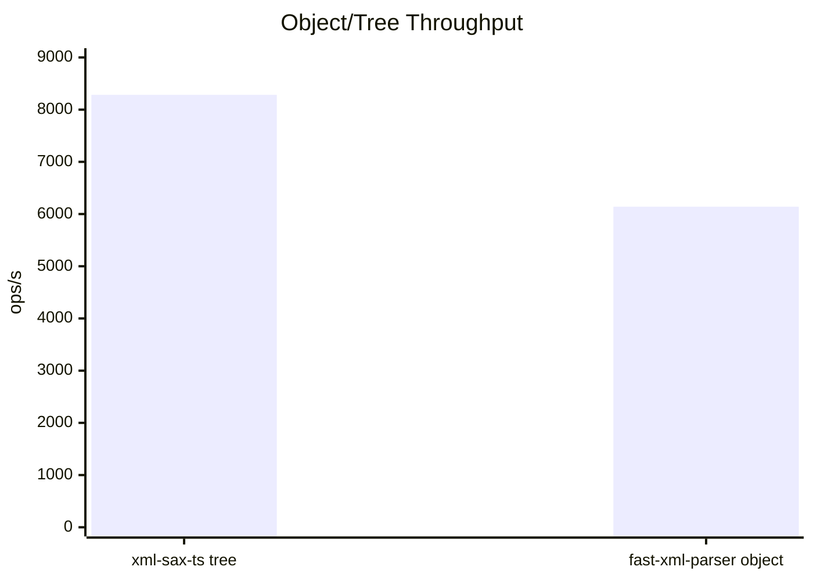
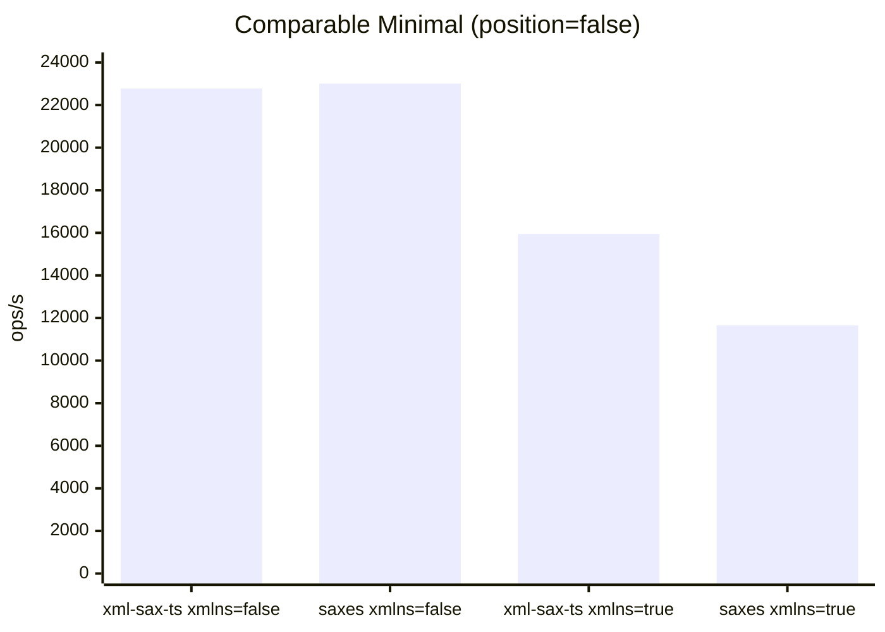

# xml-sax-ts

[](https://www.npmjs.com/package/xml-sax-ts)
[](./LICENSE)
[](https://bundlephobia.com/package/xml-sax-ts)
[](https://www.typescriptlang.org/)
[](https://nodejs.org/)
[](./package.json)

> One-pass, streaming (SAX-style) XML parser for TypeScript — works in Node.js and browsers.

## Highlights

- **Streaming** — feed chunks of XML as they arrive; no need to buffer the whole document
- **Lightweight** — zero runtime dependencies, tree-shakeable ESM + CJS
- **Type-safe** — written in TypeScript with full type exports
- **Namespace-aware** — resolves prefixes, URIs, and local names out of the box
- **Two-way** — parse XML to a tree (`parseXmlString`) or serialize a tree back to XML (`serializeXml`)
- **Design-by-contract** — invariant checks in development, stripped in production

## Install

```bash
npm install xml-sax-ts
```

## Quick start

### SAX streaming

```ts
import { XmlSaxParser } from "xml-sax-ts";

const parser = new XmlSaxParser({
  onOpenTag: (tag) => console.log("open", tag.name, tag.attributes),
  onText: (text) => console.log("text", text),
  onCloseTag: (tag) => console.log("close", tag.name),
});

parser.feed("<root>");
parser.feed("Hello</root>");
parser.close();
```

### Parse to tree

```ts
import { parseXmlString } from "xml-sax-ts";

const root = parseXmlString("<root><a>1</a><b/></root>");
console.log(root.name); // "root"
```

### Project to plain objects

```ts
import { buildObject, parseXmlString } from "xml-sax-ts";

const root = parseXmlString("<root id='1'><item>1</item><item>2</item></root>");
const obj = buildObject(root);
// { "@_id": "1", item: ["1", "2"] }
```

### Streaming object builder

```ts
import { ObjectBuilder, XmlSaxParser } from "xml-sax-ts";

const builder = new ObjectBuilder();
const parser = new XmlSaxParser({
  onOpenTag: builder.onOpenTag,
  onText: builder.onText,
  onCdata: builder.onCdata,
  onCloseTag: builder.onCloseTag
});

parser.feed("<root><item>1</item>");
parser.feed("<item>2</item></root>");
parser.close();

const obj = builder.getResult();
// { item: ["1", "2"] }
```

### Object to XML

```ts
import { objectToXml } from "xml-sax-ts";

const xml = objectToXml({
  root: {
    "@_id": "1",
    item: ["1", "2"],
  }
});

// <root id="1"><item>1</item><item>2</item></root>
```

```ts
import { buildObject, objectToXml, parseXmlString } from "xml-sax-ts";

const root = parseXmlString("<root id='1'><item>1</item></root>");
const obj = buildObject(root);
const xml = objectToXml(obj, { rootName: "root" });

// <root id="1"><item>1</item></root>
```

### Serialize to XML

```ts
import { serializeXml } from "xml-sax-ts";

const xml = serializeXml(
  {
    name: "root",
    attributes: { id: "1" },
    children: ["Hello", { name: "child", children: ["World"] }],
  },
  { pretty: true, xmlDeclaration: true },
);
// <?xml version="1.0" encoding="UTF-8"?>
// <root id="1">
//   Hello
//   <child>World</child>
// </root>
```

## Benchmarking

Run the reproducible benchmark harness:

```bash
npm run bench
```

Quick run (fewer rounds):

```bash
npm run bench:quick
```

The benchmark now runs multiple rounds and reports median/mean/stddev for better comparability.

- `xml-sax-ts:sax` scenarios measure streaming event parsing
- `xml-sax-ts:sax` scenarios include explicit `xmlns=true/false` modes
- `xml-sax-ts:sax ... no-position` shows upper-bound throughput with `trackPosition: false`
- `comparable:*` scenarios run minimal equivalent feature sets for fair `xml-sax-ts` vs `saxes` comparison
- `xml-sax-ts:tree` scenario measures full tree parsing (`parseXmlString`)
- `sax` and `saxes` scenarios provide common SAX parser comparisons
- `fast-xml-parser` scenarios measure object parsing on the same input corpus

`fast-xml-parser`, `sax`, and `saxes` are included as dev dependencies so comparison is available out of the box.

Example output includes a direct ratio line:

`Comparable parse ratio (xml-sax-ts:sax vs fast-xml-parser:object): ...x`

Note: SAX event parsing and object materialization are not identical workloads. Use the tree scenario for a closer semantic comparison.

### Benchmark Methodology

- Benchmark command: `npm run bench`
- Runtime: Node `v24.7.0`
- Benchmark config defaults: `BENCH_ROUNDS=5`, `BENCH_MIN_MS=1200`, `BENCH_WARMUP=10`
- Corpus: repeated fixture corpus (`basic.xml`, `mixed.xml`, `namespaces.xml`) plus an entity-heavy synthetic case
- Output metric: median ops/s across rounds (with mean and stddev also shown)

### Benchmark Environment

- Published sample run device: MacBook Pro M4
- Memory: 48 GB RAM
- CPU: 14-core CPU
- GPU: 20-core GPU

GPU is not used by these Node.js parser benchmarks, but listed for full machine disclosure.

Latest high-confidence sample (`BENCH_ROUNDS=6 BENCH_MIN_MS=1200 BENCH_WARMUP=20 npm run bench`, Node `v24.7.0`):

| Scenario | Median ops/s |
| --- | ---: |
| `xml-sax-ts:sax single-feed xmlns=true` | 13,806.20 |
| `xml-sax-ts:sax single-feed xmlns=false` | 19,079.17 |
| `xml-sax-ts:sax single-feed xmlns=false no-position` | 21,884.80 |
| `sax:single-feed xmlns=false` | 8,396.62 |
| `saxes:single-feed xmlns=false` | 23,139.22 |
| `xml-sax-ts:tree parseXmlString` | 8,283.71 |
| `fast-xml-parser:object parse` | 6,140.67 |

Comparable minimal feature scenarios (fair `saxes` parity check):

| Scenario | Median ops/s |
| --- | ---: |
| `comparable:xml-sax-ts single-feed xmlns=false position=false` | 22,775.14 |
| `comparable:saxes single-feed xmlns=false position=false` | 23,007.10 |
| `comparable:xml-sax-ts single-feed xmlns=true position=false` | 15,945.78 |
| `comparable:saxes single-feed xmlns=true position=false` | 11,656.96 |

- `xml-sax-ts:sax (xmlns=false)` vs `sax (xmlns=false)`: `2.272x`
- `xml-sax-ts:sax (xmlns=true)` vs `sax (xmlns=true)`: `2.739x`
- `xml-sax-ts:sax (xmlns=false)` vs `saxes (xmlns=false)`: `0.825x`
- `comparable minimal (xmlns=false, xml-sax-ts vs saxes)`: `0.990x`
- `comparable minimal (xmlns=true, xml-sax-ts vs saxes)`: `1.368x`
- `xml-sax-ts:tree` vs `fast-xml-parser:object`: `1.349x`

Benchmark visualization (same sample run):







Legend: `xml-sax-ts` bars are the first bars in each chart.

Best fair-comparison read:

- Use `comparable:*` scenarios for `xml-sax-ts` vs `saxes` parity checks.
- `xml-sax-ts ... no-position` is useful for peak throughput, but not a default-to-default comparison.

These values are machine-dependent; rerun on your hardware for release-quality numbers.

Current status for this environment: high-confidence comparable runs show `xml-sax-ts` at `0.990x` of `saxes` on `xmlns=false` and `1.368x` on `xmlns=true`.

## API

### `XmlSaxParser`

```ts
new XmlSaxParser(options?: ParserOptions)
```

| Method.       | Description                                |
| ------------- | ------------------------------------------ |
| `feed(chunk)` | Feed a string chunk to the parser          |
| `close()`     | Signal end-of-input and validate open tags |

#### `ParserOptions`

| Option                        | Type       | Default | Description                                    |
| ----------------------------- | ---------- | ------- | ---------------------------------------------- |
| `xmlns`                       | `boolean`  | `true`  | Enable namespace resolution                    |
| `includeNamespaceAttributes`  | `boolean`  | `false` | Include `xmlns:*` attributes in tag output     |
| `allowDoctype`                | `boolean`  | `true`  | Allow `<!DOCTYPE …>` declarations              |
| `coalesceText`                | `boolean`  | `false` | Merge adjacent text callbacks into one event   |
| `trackPosition`               | `boolean`  | `true`  | Track line/column; disable for faster parsing  |
| `onOpenTag`                   | `function` | —       | Called for each opening / self-closing tag     |
| `onCloseTag`                  | `function` | —       | Called for each closing tag                    |
| `onText`                      | `function` | —       | Called for text nodes                          |
| `onCdata`                     | `function` | —       | Called for CDATA sections                      |
| `onComment`                   | `function` | —       | Called for comments                            |
| `onProcessingInstruction`     | `function` | —       | Called for processing instructions (`<?…?>`)   |
| `onDoctype`                   | `function` | —       | Called for DOCTYPE declarations                |
| `onError`                     | `function` | —       | Called on parse errors                         |

By default (`coalesceText: false`), streaming input can produce multiple consecutive `onText` callbacks that are logically adjacent. Enable `coalesceText: true` to receive one merged text callback per structural boundary.

`trackPosition` controls line/column tracking for parser errors. When set to `false`, parsing is faster and `XmlSaxError` still reports `offset`, while `line` and `column` are set to `0`.

Event payload note (breaking change): with `xmlns: false`, parser events now emit plain-mode tag shapes aligned with `saxes` performance semantics.

- `onOpenTag(tag).attributes` values are strings (not `XmlAttribute` objects)
- `onOpenTag(tag)` and `onCloseTag(tag)` omit `prefix`, `local`, and `uri`
- With `xmlns: true`, full namespace metadata remains present

### `parseXmlString(xml, options?)`

Convenience function that parses a complete XML string into an `XmlNode` tree using `XmlSaxParser` + `TreeBuilder` internally.

### `TreeBuilder`

Low-level tree builder. Attach its `onOpenTag`, `onText`, `onCdata`, and `onCloseTag` methods to a parser, then call `getRoot()` to retrieve the resulting `XmlNode`.

### `buildObject(root, options?)`

Projects an `XmlNode` tree into a plain object. Attributes are prefixed (default `@_`), text is stored under `#text`, repeated elements are arrays, and elements with only text return the text directly.

### `ObjectBuilder`

Streaming builder that produces the same object shape as `buildObject` without building a full `XmlNode` tree. Attach its `onOpenTag`, `onText`, `onCdata`, and `onCloseTag` methods to the parser.

#### `ObjectBuilderOptions`

| Option             | Type                                                         | Default   | Description                                    |
| ------------------ | ------------------------------------------------------------ | --------- | ---------------------------------------------- |
| `attributePrefix`  | `string`                                                     | `"@_"`    | Prefix for attribute keys                      |
| `textKey`          | `string`                                                     | `"#text"` | Key used for text nodes                        |
| `stripNamespaces`  | `boolean`                                                    | `false`   | Strip namespace prefixes from names            |
| `arrayElements`    | `Set\<string\> \| (name: string, path: string[]) => boolean` | —         | Force specific elements to always be arrays    |
| `coalesceText`     | `boolean`                                                    | `true`    | Merge adjacent text nodes into a single string |

### `buildXmlNode(obj, options?)`

Converts a plain object into an `XmlNode` tree using the same attribute/text conventions as `buildObject`.

### `objectToXml(obj, options?)`

Builds an `XmlNode` with `buildXmlNode` and serializes it with `serializeXml`.

#### `XmlBuilderOptions`

| Option             | Type                                                         | Default   | Description                                    |
| ------------------ | ------------------------------------------------------------ | --------- | ---------------------------------------------- |
| `attributePrefix`  | `string`                                                     | `"@_"`    | Prefix for attribute keys                      |
| `textKey`          | `string`                                                     | `"#text"` | Key used for text nodes                        |
| `stripNamespaces`  | `boolean`                                                    | `false`   | Strip namespace prefixes from names            |
| `arrayElements`    | `Set\<string\> \| (name: string, path: string[]) => boolean` | —         | Force specific elements to always be arrays    |
| `rootName`         | `string`                                                     | —         | Root element name when object has multiple keys|

### `serializeXml(node, options?)`

Serializes an `XmlNode` back to an XML string.

#### `SerializeOptions`

| Option            | Type      | Default  | Description                              |
| ----------------- | --------- | -------- | ---------------------------------------- |
| `xmlDeclaration`  | `boolean` | `false`  | Prepend `<?xml …?>` declaration          |
| `pretty`          | `boolean` | `false`  | Enable indented output                   |
| `indent`          | `string`  | `"  "`   | Indentation string (when `pretty`)       |
| `newline`         | `string`  | `"\n"`   | Newline string (when `pretty`)           |

### `XmlSaxError`

Custom error class thrown on parse errors. Includes `offset`, `line`, and `column` properties for precise error location.

### Exported types

`OpenTag` · `CloseTag` · `XmlAttribute` · `ProcessingInstruction` · `Doctype` · `XmlNode` · `XmlChild` · `XmlPosition` · `ParserOptions` · `SerializeOptions` · `ObjectBuilderOptions` · `ArrayElementSelector` · `XmlObjectMap` · `XmlObjectValue` · `XmlBuilderOptions` · `XmlInputObject` · `XmlInputValue` · `ObjectToXmlOptions`

## Features

- Namespace resolution (`xmlns`)
- CDATA sections
- Entity decoding (named + numeric)
- Processing instructions
- DOCTYPE handling (parse + emit)
- Comments
- Precise error positions (line, column, offset)
- Pretty-print serialization with XML declaration

## Design-by-contract

Internal invariants are checked during development. Set `NODE_ENV=production` to strip them from production bundles — no runtime overhead.

## Development

```bash
npm install          # install dependencies
npm run build        # build ESM + CJS with tsup
npm test             # run tests with vitest
npm run test:watch   # run tests in watch mode
npm run lint         # eslint + tsc type check
npm run lint:fix     # auto-fix lint issues
```

## License

[MIT](./LICENSE) © Aaron Zielstorff
